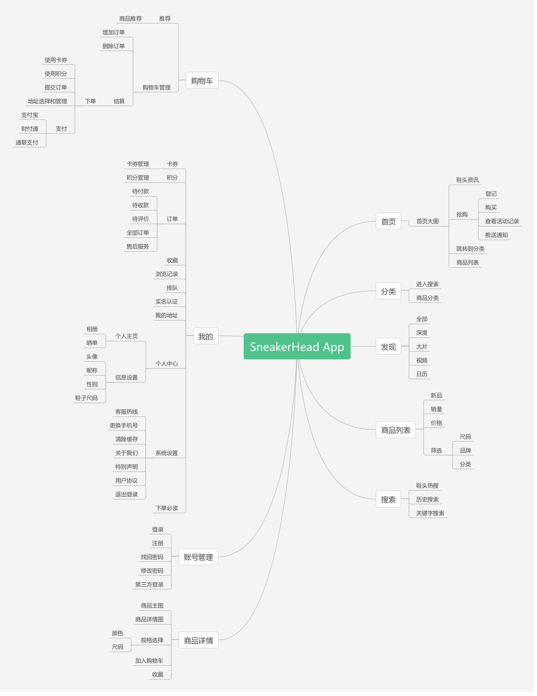
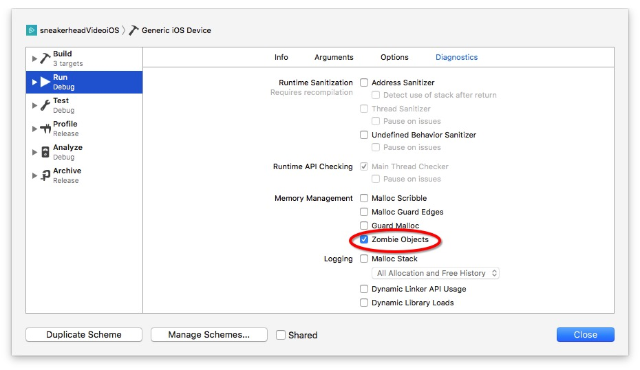
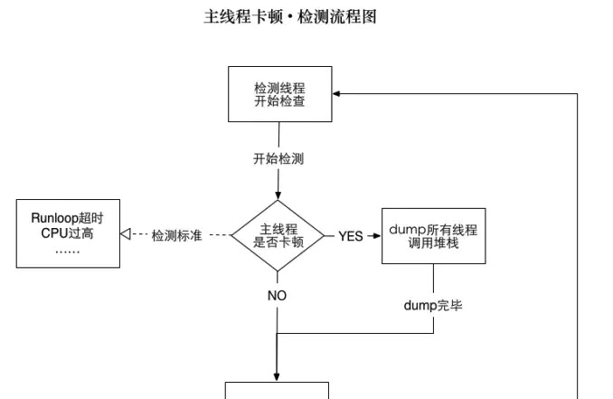

# Voyageone移动端SneakerHead App优化(iOS版)

    

> 性能对 iOS 应用的开发尤其重要，如果你的应用失去反应或者很慢，失望的用户会把他们的失望写满App Store的评论。然而由于iOS设备的限制，有时搞好性能是一件难事。开发过程中有很多需要注意的事项，所以在开发过程中容易在做出选择时忘记考虑性能影响。

## 版本管理
| 序号 | 版本 | 日期 | 修改人 | 备注 | 详细 |
|:---:|:---:|:---:|:---:|:---:|:---:|
| 1 | v1.0.0|2018.01.03|杨鹏|初始版本|添加iOS性能优化的点，后续添加性能指标，优化验收标准|
| 2|||||
| 3|||||
| 4|||||
| 5|||||
| 6|||||
| 7|||||
| 8|||||
| 9|||||
| 10|||||

## 目录

* [测试平台](#test)
* [基本工具](#base)
* [业务优化](#business)
* [内存优化](#memory)
* [卡顿优化](#kadun)
* [布局优化](#layout)
* [电量优化](#dianliang)
* [启动优化](#launch)
* [网络优化](#net)
* [数据缓存优化](#cache)
* [服务器端和客户端的交互优化](#interaction)
* [数据库优化](#db)
* [非技术性能优化](#tech)
* [Hybrid交互优化](#hybird)
* [安装包瘦身](#shou)
* [架构优化](#jiagou)
* [组件化方案](#component)
* [持续集成](#continue)

## <a name="test">测试平台</a>

> 鉴于我们公司移动端没有App测试人员，所以每一个整体的测试结果文档，不能对App的各项性能指进行详细明了的展示。这里推荐几款移动端App测试平台，有些功能需要收费，具体看需求。

* [Testin一站式云测试平台-APP云测试](https://www.testin.cn/?channel=saas_tg_bd-PT-XNCS1W&utm_source=baidu&utm_campaign=G02&utm_content=%E6%80%A7%E8%83%BD%E6%B5%8B%E8%AF%95&utm_term=app%E6%80%A7%E8%83%BD%E6%B5%8B%E8%AF%95&utm_medium=cpc)

> Testin在云端部署了300多款1000多部测试终端，终端种类及数量都比较全面。支持Android与iOS系统。但目前仅少部分服务为免费，绝大多数服务为收费项目，故而使用成本较高，具体收费情况请查看官网的介绍。

* [百度MTC专业app_测试平台](http://mtc.baidu.com/site/app?_if=694482-mtcjrkw000091_25-fcmtc11_50-mtcApp11#comp)

> 百度MTC是百度开放平台旗下的移动云测试中心。提供超过500款热门机。提供的测试服务种类有兼容性测试、性能测试、功能测试。并且提供了脚本录制工具，类似Testin。但脚本录制工具更新速度较慢。百度MTC的服务目前为收费服务，具体收费情况请查看官网的介绍。

* [MQC 阿里移动质量中心](http://mqc.aliyun.com/)

> 阿里MQC是阿里巴巴旗下的移动测试平台。提供上百款测试终端，支持Android及iOS系统。提供兼容性测试、功能测试、性能测试以及稳定性测试（1小时）。测试脚本需使用Robotium或Appium测试框架编写，难度较高。MQC也提供了远程的真机调试。

## <a name="base">基本工具</a>

> Instruments是Xcode自带的调试工具，可以检查内存泄漏，耗时，CPU使用情况，还可以检测离屏渲染等等。

### <a>Instruments 可以实现下面功能</a>

**1. 分析一个或多个进程的行为。**

**2. 记录一系列用户的动作并响应它们，可靠的再现这些事件并收集多次运行的数据。**

**3. 创建你自己自定义的 DTrace instruments 来分析系统和应用程序的行为。**

**4. 保存用户界面记录和instruments的配置为模板，并从Xcode里面访问。**

**5. 追查代码中难以重现的问题。**

**6. 对你的程序进行性能分析。**

**7. 自动化测试你的代码。**

**8. 对你程序进行压力测试。**

**9. 进行一般的系统级故障诊断。**

**10. 对你的代码如何工作有更深入的了解。**

### <a>Instruments提供的模版</a>

|序号|模版|详情|
|:-:|:-:|:-:|
|1|Blank|创建一个空的模板，你可以自定义的添加各种工具。|
|2|Activity Monitor|可以只用这个模板，研究系统工作负载和虚拟内存大小的关系|
|3|Allocations|将Allocations和VM跟踪器加到跟踪文档中，使用该工具可以监视内存和对象的内存分配方式和情况。|
|4|CocoaLayout|是一种Cocoa布局工具 ，可以应用于iOS模拟器和Cocoa桌面应用，但是不能和连接的iOS设备一起使用。观察NSLayoutConstraint对象的改变，帮助我们判断什么时间什么地点的constraint是否合理。|
|5|Core Animation|将CoreAnimation加入到跟踪文档中，可以测量ios设备上每秒的CoreAnimation帧数，这可以帮助你理解内容是如何渲染到屏幕上的，（图形性能）这个模块显示程序显卡性能以及CPU使用情况。|
|6|CoreData|将CoreData数据提取、缓存缺失和存储加入到跟踪文档中，使用这个工具可以检测应用程序中数据的存储交互。|
|7|Counters|收集使用时间或基于事件的抽样方法的性能监控计数器（PMC）事件。|
|8|Energy Log|耗电量监控，将Energy Diagnostics, CPU Activity, Display Brightness, Sleep/Wake, Bluetooth, WiFi, and GPS instruments加入到跟踪文档中进行检测。|
|9|File Activity|将File Activity, Reads/Writes, File Attributes, and Directory I/O instruments 加入到跟踪文档中，只用这个模板可以让你检查系统文件的使用情况，可以检查文件的打开、关闭、读和写操作，同时也可以检测文件系统本身的改变，包括权限和所有权发生的改变。|
|10|Leaks|将the Allocations and Leaks instruments加入到模板中，使用这个模板可以帮助你检测内存的泄漏。|
|11|Metal System Trace|它是是apple 2014年在ios平台上推出的高效底层的3D图形API，它通过减少驱动层的API调用CPU的消耗提高渲染效率。|
|12|Network|用链接工具分析你的程序如何使用TCP/IP和UDP/IP链接。|
|13|OpenGL ES Analysis|将OpenGL ES Analyzer and OpenGL ES Driver加入到模板中，这个模块测量分析OpenGL ES活动正确性检测以及表现问题，提供解决建议。|
|14|System Trace|系统跟踪，通过显示当前被调度线程提供综合的系统表现，显示从用户到系统的转换代码通过两个系统调用或内存操作。|
|15|System Usage|这个模板记录关于文件读写，sockets，I/O系统活动， 输入输出。|
|16|Time Profile|执行对系统的CPU上运行的进程低负载时间为基础采样。|
|17|Zombies|测量一般的内存使用，专注于检测过度释放的野指针对象，也提供对象分配统计，以及主动分配的内存地址历史。|
|18| Automation |允许你让 iOS 应用的用户界面测试自动化|

`其中常用的有以下几种工具：`

> Allocations，Leaks，Zombies，Core Animation，Automation，Time Profiler，Cocoa Layout，Energy Diagnostics，Network。这些工具用起来是真的爽，特别是在优化的时候，可以很好的解决你的疑问和困惑。

## <a name="business">业务优化</a>

> 业务流程优化指通过不断发展、完善、优化业务流程，从而保持企业竞争优势的策略。包括对现有工作流程的梳理、完善和改进的过程，从本质上反思业务流程，彻底重新设计业务流程，以便在当今衡量绩效的关键（如质量、成本、速度、服务）上取得突破性的改变。

**SneakerHead App基本业务导图，如下图(可能有遗漏的地方):**

### <a>需要优化的业务</a>

> App中具体的业务优化根据用户反馈等信息收集

|序号|需要优化的业务|如何优化|
|:-:|:-:|:-:|
|1|||
|2|||
|3|||
|4|||
|5|||
|6|||
|7|||
|8|||

## <a name="memory">内存优化</a>

> 相对电脑而言，移动设备具有内存少、CPU速度慢等特点，因此需要尽可能优化应用的性能。性能优化需要考虑的问题很多

### <a>常见内存泄漏情况</a>

* 循环引用

> 循环引用就是双方互相持有对方，无法进行内存释放

1. UIViewController和子UIView中双向持有对方
2. Delegate循环引用
3. Block使用双向持有
4. NSTimer

* NSNotificationCenter，KVO 问题

> 关于事件监听，属性监听，会自动retain self，所以在 dealloc 时需要对监听进行释放。

* 非OC对象内存处理

> 对于一些非OC对象，使用完毕后其内存仍需要我们手动释放。比如常用的滤镜操作调节图片亮度，CGImageRef类型变量非OC对象，其需要手动执行释放操作CGImageRelease(ref)，否则会造成大量的内存泄漏导致程序崩溃。

* 地图类处理

> 若项目中使用地图相关类，一定要检测内存情况，因为地图是比较耗费App内存的，因此在根据文档实现某地图相关功能的同时，我们需要注意内存的正确释放，大体需要注意的有需在使用完毕时将地图、代理等滞空为nil，注意地图中标注（大头针）的复用，并且在使用完毕时清空标注数组等。

* 大次数循环内存暴涨问题

> 大次数循环内产生大量的临时对象，直至循环结束才释放，可能导致内存泄漏，解决方法为在循环中创建自己的autoReleasePool，及时释放占用内存大的临时变量，减少内存占用峰值。

### <a>内存泄漏检测</a>

> 使用Analyse和Instruments工具解决内存泄露问题。

> 内存泄露指一个对象或变量在使用完成后没有释放掉，这个对象一直占用这部分内存，直到应用停止。如果这种对象过多，内存就会耗尽，其他应用就无法运行。

* 设置NSZombieEnabled

> 这是一个 “EXC_BAD_ACCESS”错误。我们打开XCode的选项：“NSZombieEnabled” 。在crash时可能会给你更多的一些提示信息。

* Analyse

> Analyze是静态分析工具。可以通过Product->Analyze菜单项启动。

* Instruments

> 上面介绍的检测[工具](#base)

****
> 我们可以结合使用Analyse和Instruments这两个工具查找泄露点。先使用Analyze静态分析查找可以泄露点，再用Instruments动态分析中的Leaks和Allocations跟踪模板进行动态跟踪分析，确认这些点是否泄露，或者是否有新的泄露出现等。

**下面介绍如何使用Instruments中的Leaks来检测内存泄漏**

打开Instruments

或者通过Profile启动Instruments

> 按上面操作，build成功后跳出Instruments工具，选择Leaks选项

* 到这里之后,我们前期的准备工作做完啦，下面开始正式的测试

1. 选中Xcode先把程序（command + R）运行起来
2. 再选中Xcode，按快捷键（command + control + i）运行起来,此时Leaks已经跑起来了
3. 由于Leaks是动态监测，所以我们需要手动操作APP,一边操作，一边观察Leaks的变化，当出现红色叉时，就监测到了内存泄露，点击右上角的第二个，进行暂停检测(也可继续检测，当多个时暂停，一次处理了多个)
如下图：

4. 下面就是定位修改了,此时选中有红色柱子的Leaks，下面有个”田”字方格，点开，选中Call Tree

5. 下面就是最关键的一步，在这个界面的下面有若干选框，选中CallTree后勾选 Inver Call Tree和Hide System Libraries,（红圈范围内）显示如下：

6. 选中显示的若干条中的一条，双击，会自动跳到内存泄露代码处，如图所示 

7. 找到了内存泄露的地方，那么我们就可以修改即可

### <a>内存优化</a>

* 使用ARC

> 使用ARC进行内存管理。ARC(Automatic ReferenceCounting, 自动引用计数)和iOS5一起发布，它避免了最常见的也就是经常是由于我们忘记释放内存所造成的内存泄露。它自动为你管理retain和release的过程，所以你就不必去手动干预了。忘掉代码段结尾的release简直像记得吃饭一样简单。而ARC会自动在底层为你做这些工作。除了帮你避免内存泄露，ARC还可以帮你提高性能，它能保证释放掉不再需要的对象的内存。

* 避免循环引用

* 在正确的地方使用reuseIdentifier

* 避免过于庞大的XIB

> 当你加载一个XIB的时候所有内容都被放在了内存里，包括任何图片。如果有一个不会即刻用到的view，你这就是在浪费宝贵的内存资源了。Storyboards就是另一码事儿了，storyboard仅在需要时实例化一个view controller。

* 重用和延迟加载(lazy load) Views

> 更多的view意味着更多的渲染，也就是更多的CPU和内存消耗，对于那种嵌套了很多view在UIScrollView里边的app更是如此。

* 处理内存警告

> 如果你的app收到了内存警告，它就需要尽可能释放更多的内存。最佳方式是移除对缓存，图片object和其他一些可以重创建的objects的strong references

* 使用Autorelease Pool

## <a name="kadun">卡顿优化</a>

> 对于界面卡顿，通常我们拿用户日志作用不大，增加日志点也用处不大。只能不断重试希望能够重现出来，或者埋头代码逻辑中试图能找的蛛丝马迹。

#### <a>界面卡顿是由哪些原因导致的？</a>

* 死锁：主线程拿到锁 A，需要获得锁 B，而同时某个子线程拿了锁 B，需要锁 A，这样相互等待就死锁了。
* 抢锁：主线程需要访问 DB，而此时某个子线程往 DB 插入大量数据。通常抢锁的体验是偶尔卡一阵子，过会就恢复了。
* 主线程大量 IO：主线程为了方便直接写入大量数据，会导致界面卡顿。
* 主线程大量计算：算法不合理，导致主线程某个函数占用大量 CPU。
* 大量的 UI 绘制：复杂的 UI、图文混排等，带来大量的 UI 绘制。

#### <a>针对这些原因，我们可以怎么定位问题呢？</a>

* 死锁一般会伴随 crash，可以通过 crash report 来分析。
* 抢锁不好办，将锁等待时间打出来用处不大，我们还需要知道是谁占了锁。
* 大量 IO 可以在函数开始结束打点，将占用时间打到日志中。
* 大量计算同理可以将耗时打到日志中。
* 大量 UI 绘制一般是必现，还好办；如果是偶现的话，想加日志点都没地方，因为是慢在系统函数里面。

#### <a>监控主线</a>

> 如果可以将当时的线程堆栈捕捉下来，那么上述难题都迎刃而解。主线程在什么函数哪一行卡住，在等什么锁，而这个锁又是被哪个子线程的哪个函数占用，有了堆栈，我们都可以知道。自然也能知道是慢在UI绘制，还是慢在我们的代码。所以，思路就是起一个子线程，监控主线程的活动情况，如果发现有卡顿，就将堆栈dump下来。

#### <a>实现细节</a>

* 具体到卡顿检测，有几个问题需要仔细处理

1. 怎么知道主线程发生了卡顿？
2. 子线程以什么样的策略和频率来检测主线程？这个是要发布到现网的，如果处理不好，带来明显的性能损耗（尤其是电量），就不能接受了。
3. 堆栈上报了上来怎么分类？直接用crash report的分类不适合。
4. 卡顿 dump 下来的堆栈会有多频繁？数据量会有多大？
5. 全量上报还是抽样上报？怎么在问题跟进与节省流量直接平衡？

* 判断标准

> 怎么判断主线程是不是发生了卡顿？一般来说，卡顿大概有几个特征

1. CPU 占用超过了100%
2. 主线程 Runloop 执行了超过2秒

* 检测策略

> 为了降低检测带来的性能损耗，检测线程的策略设置如下

1. 内存 dump：每1秒检查一次，如果检查到主线程卡顿，就将所有线程的函数调用堆栈 dump 到内存中。
2. 文件 dump：如果内存 dump 的堆栈跟上次捕捉到的不一样，则 dump 到文件中；否则按照斐波那契数列将检查时间递增（1，1，2，3，5，8…）直到没有遇到卡顿或卡顿堆栈不一样。这样能够避免同一个卡顿写入多个文件的情况，也能避免检测线程围着同一个卡顿空转的情况。
3. 日志上传

## <a name="layout">布局优化</a>

> 视图布局的计算是 App 中最为常见的消耗 CPU 资源的地方。如果能在后台线程提前计算好视图布局、并且对视图布局进行缓存，那么这个地方基本就不会产生性能问题了。不论通过何种技术对视图进行布局，其最终都会落到对 UIView.frame/bounds/center 等属性的调整上。上面也说过，对这些属性的调整非常消耗资源，所以尽量提前计算好布局，在需要时一次性调整好对应属性，而不要多次、频繁的计算和调整这些属性。

### <a>AutoLayout性能分析</a>

> 对100~1000个视图布局所需要的时间的折线图

> 从图中可以看到，使用 Auto Layout 进行布局的时间会是只使用 frame 的 16 倍左右，虽然这里的测试结果可能受外界条件影响差异比较大，不过 Auto Layout 的性能相比 frame 确实差很多，如果去掉设置 frame 的过程消耗的时间，Auto Layout 过程进行的计算量也是非常巨大的。我们知道，想要让 iOS 应用的视图保持 60 FPS 的刷新频率，我们必须在 1/60 = 16.67 ms 之内完成包括布局、绘制以及渲染等操作。也就是说如果当前界面上的视图大于 100 的话，使用 Auto Layout 是很难达到绝对流畅的要求的；而在使用 frame 时，同一个界面下哪怕有 500 个视图，也是可以在 16.67 ms 之内完成布局的。不过在一般情况下，在 iOS 的整个 UIWindow 中也不会一次性出现如此多的视图。我们更关心的是，在日常开发中难免会使用 Auto Layout 进行布局，既然有 16.67 ms 这个限制，那么在界面上出现了多少个视图时，我才需要考虑其它的布局方式呢？在这里，我们将需要布局的视图数量减少一个量级10-90个视图，重新绘制一个图表：

> 从图中可以看出，当对 30 个左右视图使用 Auto Layout 进行布局时，所需要的时间就会在 16.67 ms 左右，当然这里不排除一些其它因素的影响；到目前为止，会得出一个大致的结论，使用 Auto Layout 对复杂的 UI 界面进行布局时（大于 30 个视图）就会对性能有严重的影响（同时与设备有关，文章中不会考虑设备性能的差异性）

> 虽然说 Auto Layout 为开发者在多尺寸布局上提供了遍历，而且支持跨越视图层级的约束，但是由于其实现原理导致其时间复杂度为多项式时间，其性能损耗是仅使用 frame 的十几倍，所以在处理庞大的 UI 界面时表现差强人意，幸好我们App的UI不是很复杂。

### <a>布局优化的点</a>

* 控件的创建和布局分离
* 对各种设备进行合理的适配
* 布局警告全部解决
* 布局依赖简明
* 后续可以使用第三方框架(ComponentKit、AsyncDisplayKit)，主要是针对frame属性进行调整布局

## <a name="dianliang">电量优化</a>

> iOS设备的运行通常使用的都是电池，应用采取的每个动作都会消耗电量。iOS设备上电量的使用大户主要有：

> 1）屏幕显示与背光。

>2）位置服务。

>3）wifi-无线电.

>4）WWAN(蜂窝)无线电。

>5）图形处理器。

>6）CPU。

>7）蓝牙无线电。

>8）声音处理器。

>除了屏幕显示之外，应用能够控制上面的大多数

### <a>耗电量检测</a>

* 进入手机"设置" -> "电池",可以直观的看出来手机应用的耗电情况

* 使用xcode打开你的工程,然后插上手机,使用真机running项目(必须是真机),然后comand + 6,点击Energy Impact

> 蓝色表示--合理,黄色--表示程序比较耗电,红色--表示仅仅轻度使用你的程序,就会很耗电。

> 图表中Utilization栏中是表示瞬时耗电情况
> 图表中Average栏中,表示平均耗电情况
> 图表中Energy Impact中cost(蓝色)表示运行项目代码需要电量,Overhead(红色)表示开销,包括CPU的唤起,无线电模组(蓝牙&WiFi),和其他系统资源的调用等

> 影响电量的五个因素,灰色表示有电量消耗,白色表示没有电量消耗。

> CPU : CPU使用率超过20%就会快速耗干电池电量。

> Network : 网络活动会唤起需要长时间周期性供电的无线电模组,可以分批次进行网络请求,来降低开销。

> Location : 精密&高频的的定位会增加开销,需要按需使用。

> GPU : 图形处理器(显卡的处理器),乱使用GPU会导致交互差,并且降低电池寿命。

> Background : 后台状态App仍会消耗电量,App要按需执行后台操作,并使用延迟APIs来保证系统运算高效执行.另外,在app进入后台状态是,立即减少动作,并且通知系统一次这些动作已经完成。

* 使用Instrument的Energy Log

#### 第一步 : 打开手机设置,点击"开发者"

#### 第二步 : 点击Logging

#### 第三步 : 勾选Energy,并点击startRecording

#### 第四步 : 运行需要测试的App(确保手机消耗的是手机自身的电池),运行3-5分钟,再进入手机设置点击stopRecording

#### 第五步 : 使用xcode,把手机和xcode相连,并打开Instruments中的Energy Log,点击工具栏中import Logged Data from Device

#### 第六步 : 得到了电池损耗日志

> Energy Usage Level的值(0 -- 20),值越大表示越耗电

> CPU Activity 表示CPU各种活动

### <a>耗电量优化</a>

#### 代码层面的优化

* 合理使用高开销对象

> 比如NSDateFormatter的性能瓶颈是由于NSDate格式到NSString格式的转化,所以把NSDateFormatter创建单例意义不大.推荐的做法是,把最常用到的日期格式做缓存。

* 不要频繁的刷新页面,能刷新1行cell最好只刷新一行,尽量不要使用reloadData
* 选择正确的集合

	1. NSArray,使用index来查找很快(插入和删除很慢)
	2. 字典,使用键来查找很快
	3. NSSets,是无序的,用键查找很快,插入/删除很快

* 少用运算获得圆角,不论view.maskToBounds还是layer.clipToBounds都会有很大的资源开销,必须要用圆角的话,不如把图片本身就做成圆角
* 懒加载,不要一次性创建所有的subview,而是需要时才创建
* 重用

> 可以模仿UITableView和UICollectionView,不要一次性创建所有的subview,而是需要时才创建。完成了使命,把他放入到一个可重用集合中。

* 图片处理

	1. 图片与imageView相同大小,避免多余运算
	2. 复杂UI可以使用整副的图片,增加应用体积,但是节省CPU
	3. 可调大小的图片,可以省去一些不必要的空间，使用pdf

* cache(缓存所有需要的)

	1. 对服务器相应结果的缓存(图片)
	2. 复杂计算结果的缓存(UITableView的行高)

* 尽量少用透明或半透明,会产生额外的运算
* 使用ARC减少内存失误,dealloc需要重写并对属性置为nil
* 避免庞大的xib,storyBoard,尽量使用纯代码开发
* Timer的时间间隔不宜太短,满足需求即可
* 线程适量,不宜过多,不要阻塞主线程
* 优化算法,减少循环次数
* 定位和蓝牙按需取用,定位之后要关闭或降低定位频率

## <a name="launch">启动优化</a>

> 应用启动时间，直接影响用户对一款应用的判断和使用体验。我们的App本身就包含非常多并且复杂度高的业务模块，也接入了很多第三方的插件，这势必会拖慢应用的启动时间，本着精益求精的态度和对用户体验的追求，当然也希望在业务扩张的同时最大程度的优化启动时间。

	先说结论，t(App总启动时间) = t1(main()之前的加载时间) + t2(main()之后的加载时间)。 t1 = 系统dylib(动态链接库)和自身App可执行文件的加载；t2 = main方法执行之后到AppDelegate类中的。
	- (BOOL)Application:(UIApplication *)Application didFinishLaunchingWithOptions:(NSDictionary *)launchOptions方法执行结束前这段时间，主要是构建第一个界面，并完成渲染展示。

### <a>main()之前的加载时间如何衡量和优化</a>

> 那么问题就来了，那怎么衡量main()之前也就是time1的耗时呢，苹果官方提供了一种方法，那就是在真机调试的时候勾选DYLD_PRINT_STATISTICS 设为 1。

会得到如下形式的输出：

**对于main()调用之前的耗时我们可以优化的点有:**

* 减少不必要的framework，因为动态链接比较耗时。
* check framework应当设为optional和required，如果该framework在当前App支持的所有iOS系统版本都存在，那么就设为required，否则就设为optional，因为optional会有些额外的检查。
* 合并或者删减一些OC类，关于清理项目中没用到的类。
* 删减一些无用的静态变量。
* 删减没有被调用到或者已经废弃的方法。
* 将不必须在+load方法中做的事情延迟到+initialize中。
* 尽量不要用C++虚函数(创建虚函数表有开销)。

### <a>main()调用之后的加载时间和优化</a>

> 在main()被调用之后，App的主要工作就是初始化必要的服务，显示首页内容等。而我们的优化也是围绕如何能够快速展现首页来开展。 App通常在AppDelegate类中的- (BOOL)Application:(UIApplication *)Application didFinishLaunchingWithOptions:(NSDictionary *)launchOptions方法中创建首页需要展示的view，然后在当前runloop的末尾，主动调用CA::Transaction::commit完成视图的渲染。 

**视图的渲染主要涉及三个阶段:**

* 准备阶段 这里主要是图片的解码。
* 布局阶段 首页所有UIView的- (void)layoutSubViews()运行。
* 绘制阶段 首页所有UIView的- (void)drawRect:(CGRect)rect运行再加上启动之后必要服务的启动、必要数据的创建和读取，这些就是我们可以尝试优化的地方。

**因此，对于main()函数调用之前我们可以优化的点有：**

* 不使用xib，直接视用代码加载首页视图。
* NSUserDefaults实际上是在Library文件夹下会生产一个plist文件，如果文件太大的话一次能读取到内存中可能很耗时，这个影响需要评估，如果耗时很大的话需要拆分(需考虑老版本覆盖安装兼容问题)。
* 每次用NSLog方式打印会隐式的创建一个Calendar，因此需要删减启动时各业务方打的log，或者仅仅针对内测版输出log。
* 梳理应用启动时发送的所有网络请求，是否可以统一在异步线程请求。

### <a>如何找到拖慢启动应用时长的瓶颈</a>

> 为了找到瓶颈，我们在启动之后的didFinishLauhcning方法开始执行到RootViewController的viewDidAppear方法，几乎每个可能比较耗时的流程进行拆分和统计，得到统计数据之后进行优化。

## <a name="net">网络优化</a>

> 网络优化对于App产品的用户体验至关重要，与公司的运营和营收息息相关。这里列举两个公开的数据：

> “页面加载超过3秒，57%的用户会离开。”

> “Amazon页面加载延长1秒，一年就会减少16亿美金营收。”

> 在做网络优化前，我们首先要为网络通信质量设立一个标尺。

> 目前我们公司没有网络服务监控后台，也没有集成第三方网络监控平台，但是基于网络优化的重要性，这里还是写了如何进行网络优化

### 基于网络状态码对网络请求进行监控

> 通过状态码的分段范围，也可以迅速清晰地看到网络成败的原因和占比，例如下图。

> 有了监控工具后，我们来讨论：移动网络请求过程中，出现了哪些最常见的问题？

* 首先是网络不可用的问题。主要由以下几种原因导致：

1. GFW的拦截，原因你懂的。
2. DNS的劫持，端口的意外封禁等。
3. 偏远地区网络基础设施比较差。

* 其次是网络加载时间长。原因包括：

1. 移动设备出于省电的目的，发出网络请求前需要先预热通信芯片。
2. 网络请求需要跨网络运营商，物理路径长。
3. HTTP请求是基于Socket设计的，请求发起之前会经历三次握手，断开时又会进行四次挥手。

* 最后是HTTP协议的数据安全问题。原因有：

1. HTTP协议的数据容易被抓包。Post包体数据经过加密能够避免泄露，但协议中的URL和header部分还是会暴露给抓包软件。HTTPS也面临相似的问题。
2. 运营商数据恶意篡改严重。

### 网络优化点

* 提供网络服务重发机制

> 移动网络不稳定，如果一次网络服务失败，就立刻反馈给用户你失败了，体验并不友好。我们提供了网络服务重发机制，即当网络服务在连接失败、写Request失败、读Response失败时自动重发服务；长连接失败时就用短连接来做重发补偿，短连接服务失败时当然还是用短连接来补偿。这种机制增加了用户体验到的服务成功概率。当然不是所有网络服务都可以重发，例如当下订单服务在读取Response失败时，就不能重发，因为下单请求可能已经到达服务器，此时重发服务可能会造成重复订单，所以我们可以设置重发服务开关，业务段可以自行控制是否需要。

* 网络质量检测（根据网络质量来改变策略）

> 针对网络连接和读写操作的超时时间，我们可以设置网络质量检测机制。目前做到的是根据用户是在2G/3G/4G/Wi-Fi的网络环境来设置不同的超时参数，以及网络服务的并发数量。2G/3G/4G网络环境对并发TCP连接的数量是有限制的（2G网络下运营商经常只能允许单个Host一个TCP连接），因此网络服务重要参数能够根据网络质量状况来动态设定对性能和体验都非常重要。

* 收拢网络底层

> 随着公司的成长，开发团队越来越多，不可避免的将会引入越来越多的网络库。网络库多了之后，再对网络请求进行集中管理就非常困难了。所以的建议在网络库与业务代码之间架设自己的网络层，业务的网络请求全部经过网络层代码进行请求。这样未来进行底层网络库的更换，或者网络通道的优化将变得容易很多。

* 使用网络监控

> 引入网络监控机制，发现网络问题。推荐一款美团开源的[Cat](http://github.com/dianping/cat)监控系统。

* 数据格式优化，减少数据传输量和序列化时间

> 传输数据量越小，在相同TCP连接上的传输时间越短。我们目前都使用json数据格式进行传输（XML基本不用了）,Google出了ProtocolBuffer，在传输数据量较大的需求场景下，ProtocolBuffer比XML、Json 更小、更快、使用和维护更简单！

* IP直连方案

> 所有的HTTPS请求都将域名更换为跑马最快的IP,所有请求基于TCP连接，直接跳过了DNS解析阶段，使用内置IP列表的方式进行网络连接。HTTPS由于要求证书绑定域名，如果做IP直连方案可能会遇到一些麻烦，这时我们需要对客户端的HTTPS的域名校验部分进行改造,[参见](http://blog.csdn.net/github_34613936/article/details/51490032 )。

* 优化海外网络性能

> 海外网络性能的优化手段主要是通过花钱，例如CDN加速，提高带宽，实现动静资源分离，对于App中的Hybrid模块优化效果非常明显。

### 最后看看业界网络性能优化的新技术方向，目前最有潜力的是Google推出的SPDY和QUIC协议

> [SPDY](https://www.chromium.org/spdy/spdy-whitepaper)已成为HTTP/2.0 Draft，有希望成为未来HTTP协议的新标准。HTTP/2.0提供了很多诱人的特性（多路复用、请求优先级、支持服务端推送、压缩HTTP Header、强制SSL传输、对服务端程序透明等）。国内很多App包括美团、淘宝、支付宝都已经在尝试使用SPDY协议，Twitter的性能测试表明可以降低30%的网络延迟，携程也做了性能测试，由于和TCP性能差距不明显，暂未在生产上使用。

> [QUIC](https://www.chromium.org/quic)是基于UDP实现的新网络协议，由于TCP协议实现已经内置在操作系统和路由器内核中，Google无法直接改进TCP，因此基于无连接的UDP协议来设计全新协议可以获得很多好处。首先能够大幅减少连接时间，QUIC可以在发送数据前只需要0 RTT时间，而传统TCP/TLS连接至少需要1-3 RTT时间才能完成连接（即使采用Fast-Open TCP或TLS Snapshot）；其次可以解决TCP Head-of-Line Blocking问题，通常前一个TCP Packet发送成功前会拥塞后面的Packet发送，而QUIC可以避免这样的问题；QUIC也有更好的移动网络环境下拥塞控制算法；新的连接方式也大幅减少了Connectiont Migration问题的影响。

##	<a name="cache">数据缓存优化</a>

> 在现在的App开发中，缓存越发的显得重要，在很大层面上缓存能对系统性能带来很大的提升。cache 是一种常见的空间换时间提升性能的机制，可以用在相当多的场合。尽量 cache 那些可重复利用的对象，缓存那些不大可能改变但是需要经常读取的东西，比如table cell、date/number formatters、远端服务器的响应、图片、甚至计算结果（UITableView的行高）等

* 缓存一般组成，一个是内存缓存，一个是磁盘缓存。

	1. 对于内存缓存来说，一般使用字典来作为数据的缓存池，配合一个保存每个内存缓存数据的缓存时间的字典，一个保存每个内存缓存数据的缓存容量的字典，一个保存内存缓存总容量的变量。对于增删改查操作，基本也都是围绕着字典来的，需要重点注意的就是在这些个操作过程的多线程安全问题，还有同步和异步访问方法，以及异步方法中的Block参数的循环引用问题。
	2. 对于磁盘缓存来说，使用文件系统来保存缓存数据，配合设置文件的参数，比如文件的修改日期（访问一次即修改一次），文件的大小来管理着这个缓存数据。对缓存数据的增删改查，也就是转化成为对文件的读写删除操作。
	3. 不管是内存缓存还是磁盘缓存，在删除超过限制容量的缓存的时候总是有一个同样的策略。有优先删除缓存最久，最少使用的策略，也有优先删除，容量最大，最少使用的策略。没有什么最好的策略，只有适合你业务产品的策略。

* 直接写文件方式：可以存储的对象有NSString、NSArray、NSDictionary、NSData、NSNumber，数据全部存放在一个属性列表文件（*.plist文件）中。
* NSUserDefaults（偏好设置），用来存储应用设置信息，文件放在perference目录下。
* 归档操作（NSkeyedArchiver），不同于前面两种，它可以把自定义对象存放在文件中。
* CoreData:CoreData是苹果官方iOS5之后推出的综合型数据库，其使用了ORM(Object Relational Mapping)对象关系映射技术，将对象转换成数据，存储在本地数据库中。
* FMDB：FMDB是iOS平台的SQLite数据库框架，FMDB以OC的方式封装了SQLite的C语言API，使用起来更加面向对象，省去了很多麻烦、冗余的C语言代码，对比苹果自带的Core Data框架，更加轻量级和灵活，提供了多线程安全的数据库操作方法，有效地防止数据混乱。
* 使用第三方缓存框架：常见的内存缓存有NSCache、TMMemoryCache、PINMemoryCache、YYMemoryCache，常见的磁盘缓存有TMDiskCache、PINDiskCache、SDWebImage。

|序号|App中需要缓存的数据|目前的缓存策略的不足|改进|
|:-:|:-:|:-:|:-:|
|1||||
|2||||
|3||||
|4||||
|5||||
|6||||
|7||||
|8||||
|9||||
|10||||

## <a name="interaction">服务器端和客户端交互优化</a>

> 服务器端和客户端进行交互优化主要是对数据的交互进行最优和最快的传递。

**1. 客户端尽量减少请求。（减少服务器并发压力）**

**2. 服务端尽量做多的逻辑处理。（客户端不适合做过多的逻辑处理）**

**3. 接口的版本管理。（版本升级后可以向下进行兼容）**

**4. 通信协议的优化。（减少报文的大小）**

## <a name="db">数据库优化</a>

> 数据库优化,SneakerHead App未使用数据库存储数据，此项暂时不写。

### 

## <a name="tech">非技术性能优化</a>

> 非技术性能优化主要是对产品设计，界面交互，代码规范，code review以及在项目开发过程中遇到的坑的解决方法。

### <a>产品设计的逻辑性</a>

> 产品的设计一定要符合逻辑，或者逻辑尽量简单，否则会让程序员抓狂，有时候用了好大力气，才可以完成一个小小的逻辑设计问题。

### <a>界面交互的规范</a>

> 每个模块的界面的交互尽量统一，符合操作习惯。

### <a>代码规范</a>

> 这个可以隐形带来app 性能的提高，比如 用if else 还是switch ，或者是用！还是＝＝。

### <a>code review</a>

> 坚持code Review 持续重构代码。减少代码的逻辑复杂度。

### <a>日常交流</a>

> 经常分享一些代码，或者逻辑处理中的坑。

## <a name="hybird">Hybrid交互优化</a>

> Hybrid交互优化主要包括jsBridge和Scheme优化以及页面渲染速度的优化。

### <a>jsBridge优化</a>

> 主要是js和本地UIWebView和WKWebView进行交互的优化，这个要配合前端进行协调优化。

### <a>Scheme优化</a>

> 包括两个方面，一个是和本地的UIWebView和WKWebView进行交互的优化，另外一个是页面之前的跳转和数据传递之间的优化。

### <a>页面渲染速度优化</a>

> UIWebView、WKWebView加载顺序，可以从这每个步骤入手进行渲染速度的优化。

> 利用缓存数据加快页面渲染,在head里面写一个jsonp发送cgi请求，这样就达到了与资源并行的目的；将拉取的数据存在一个对象中，判断数据是否返回，如果返回的话，就用新的数据进行渲染，如果没有返回那么还是用上面的缓存数据。

> 然而，在很多情况下，很多数据并不适合利用缓存的，比如一些页面打开的很频繁（一些热门的帖子，经常打开），或者只看一次就不看了；而且localstorage本身也有大小限制。在点击页面到打开webview之间一般存在一定的延时，尤其是android的机型，一般有1-2秒的打开时间，这是时候，可以利用这段时间来尽量做一些事情。

> 总结上面几种方案

> 局部滚动长列表优化，一般的滚动长列表可以分为两种：一种是数目条数限定的，就几十条数据的滚动，另一种是无限滚动。对于数据量比较大的列表，容易出现卡顿的情况。这一块交给前端工程师来完善吧。

## <a name="shou">安装包瘦身</a>

> App安装包是由资源和可执行文件两部分组成，安装包瘦身也是从这两部分进行。

### <a>资源瘦身</a>

**1. 删除无用的资源**

使用[LSUnusedResources](https://github.com/tinymind/LSUnusedResources)工具自动检测或者手动检查删除无用的资源。

**2. 删除重复的资源**

重复资源（主要指图片）不是指命名重复而是内容相同。[fdupes](https://github.com/adrianlopezroche/fdupes) 是Linux下的一个工具，可以在指定的目录及子目录中查找重复的文件。fdupes通过对比文件的MD5签名，以及逐字节比较文件来识别重复内容。项目中图片分两处存放，Assets.xcassets和images文件夹，所以在这两个目录查找就可以。

` fdupes -r xxx/images xxx/Images.xcassets`

**3. 无损压缩图片**

[ImageOptim](https://github.com/ImageOptim/ImageOptim)是一款优秀的无损图片压缩工具，它通过优化压缩参数，移除无用的文件元数据和不必要的颜色配置来实现图片的无损压缩。美工出图要对图片进行一次无损压缩，发布前用工具对图片压缩一次。（在编译设置中将COMPRESS_PNG_FILES和STRIP_PNG_TEXT设置NO）

**4. 图片管理方式**

主要有两个方式管理图片，一种是在项目中添加文件夹存放，另一种是放在Assets.xcassets管理。推荐使用Assets.xcassets管理，因为它会把里边的所有 png 格式的图片压缩成一个Assets.car文件，压缩比率比其他方式管理图片要高，大大减少图片体积。

**5. 其他**

* 上面主要讨论的是图片资源，其它资源文件如音频、视频都可以进行压缩处理，项目中还有些没用的plist,readme之类的文件可以删掉。
* 另外xxx.proto文件也放在项目中，其实这个文件在项目中也是不用的，完全可以删掉！如果包含在bundle里面不仅增加安装包体积还存在相关安全隐患。
* 有些非必要的文件资源可以放在服务器，结合本地缓存策略。
* 删除无用的代码等等

# <a name="jiagou">架构优化</a>

> 架构优化，待续...

# <a name="component">组件化方案</a>

> 组件化方案,待续...

# <a name="continiu">持续集成</a>

> 持续集成，待续...